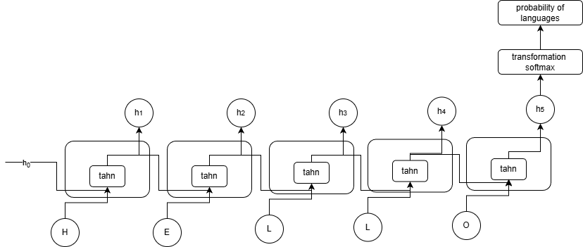

**Describe the types of tasks for which recurrent neural networks are useful. (Для каких задач полезны RNN).**
RNN приспособлена работать с последовательностями:
* Обработка текстов.
* Обработка звуков.
* Работа с последовательностями событий.
* Работа с временными рядами.

**Give 2 examples of one-to-many, many-to-many, and many-to-one formulations of the problem (Примеры one-to-many, many-to-many, many-to-one).**

One-to-many (один вход → последовательность выходов):
* Генерация подписи к изображению.
* Генерация мелодии по одному «стилю/тегу».

Many-to-one (последовательность входов → один выход):
* Классификация настроения текста.
* Определение пола по имени.

Many-to-many (последовательность → последовательность):
* Машинный перевод.
* Распознавание речи.

**Explain the main difference between vanilla RNN, LSTM, and GRU (Главное отличие между vanilla RNN, LSTM и GRU).**
Все три нейронные сети рекурентные, однако имеют разные механизм "запоминания" - в vanilla RNN он отсутствует, в результате чего градиент очень быстро затухает и модель не может эффективно работать с длинными последовательностями. В LSTM и GRU есть блоки памяти, которые позволяют хранить, обновлять или удалять информацию.

